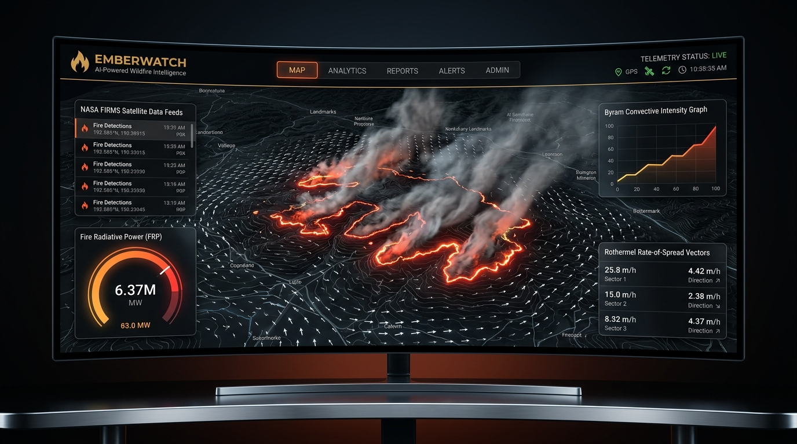
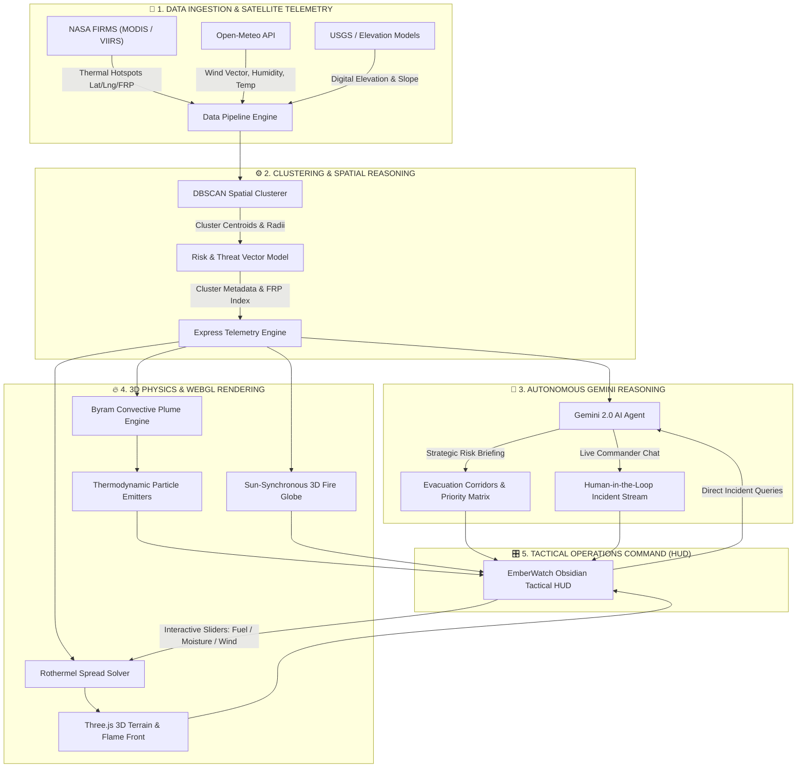
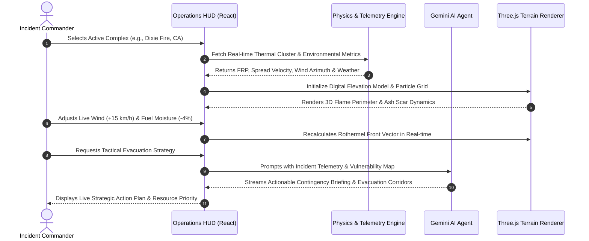

# 🔥 EMBERWATCH
### Cinematic 3D Wildfire Intelligence & Autonomous Incident Command Platform

<div align="center">

[](https://opensource.org/licenses/MIT)
[](https://reactjs.org/)
[](https://www.typescriptlang.org/)
[](https://threejs.org/)
[](https://vitejs.dev/)
[](https://ai.google.dev/)
[](https://firms.modaps.eosdis.nasa.gov/)

<br />

**Real-Time Satellite Anomaly Tracking • Rothermel Topographic Spread Engine • Byram Convective Intensity • Three.js WebGL Graphics • Autonomous Gemini Crisis AI**



</div>

---

## 📖 Overview

**EmberWatch** is a next-generation wildfire intelligence and disaster response platform designed for incident commanders, forestry services, and emergency responders. By bridging orbital Earth-observation data with real-time thermodynamic simulation and cutting-edge generative AI, EmberWatch transforms raw thermal anomalies into actionable, predictive tactical briefings.

Traditional wildfire monitoring relies on static 2D perimeter maps with latency spanning hours. **EmberWatch eliminates this blind spot** by combining:
1. **Sub-pixel orbital thermal detection** (NASA FIRMS MODIS & VIIRS).
2. **Physics-based 3D terrain propagation** (Rothermel Rate of Spread + Byram Fireline Intensity).
3. **Conversational Multi-Agent AI** powered by Google Gemini, capable of synthesizing micro-meteorology, fuel dynamics, and population vulnerability into human-readable strategic action plans.

---

## 📸 Visual Showcase & Interface Tour

<div align="center">
<table>
  <tr>
    <td width="50%">
      <h3 align="center">🌐 Orbital Global 3D Fire Globe</h3>
      
      <p align="center"><i>Interactive WebGL Earth rendering real-time active wildfire clusters aggregated from NASA FIRMS sub-pixel sensors.</i></p>
    </td>
    <td width="50%">
      <h3 align="center">🏔️ Rothermel 3D Topographic Terrain</h3>
      
      <p align="center"><i>Digital elevation modeling with dynamic flame perimeter expansion, ash scar propagation, and wind vector coupling.</i></p>
    </td>
  </tr>
  <tr>
    <td width="50%">
      <h3 align="center">⚡ Convective Plume & Ember Lift</h3>
      
      <p align="center"><i>Thermodynamic particle simulation visualizing Byram convective heat output, flame tilt angle, and atmospheric lofting.</i></p>
    </td>
    <td width="50%">
      <h3 align="center">🤖 Gemini Strategic Crisis AI</h3>
      
      <p align="center"><i>Autonomous incident agent reasoning over live cluster telemetry, population risk corridors, and resource logistics.</i></p>
    </td>
  </tr>
</table>
</div>

---

## 🔄 Application Architecture & Workflow

EmberWatch employs a multi-tiered pipeline connecting satellite ingestion, spatial clustering, thermodynamic physics solvers, generative reasoning, and a 60 FPS WebGL frontend.

### 1. End-to-End System Flowchart



### 2. Incident Commander Tactical Workflow



---

## ⚡ Core Features & Technical Deep Dive

### 🌐 1. Sun-Synchronous Global 3D Fire Globe (`FireGlobe3D.tsx`)
- **NASA FIRMS Integration**: Ingests Moderate Resolution Imaging Spectroradiometer (MODIS) and Visible Infrared Imaging Radiometer Suite (VIIRS) satellite thermal detections.
- **DBSCAN Spatial Clustering**: Dynamically aggregates dispersed pixel-level fire points into localized macro-complexes with computed centroids, bounding diameters, and aggregate Fire Radiative Power (MW).
- **Sun-Synchronous Day/Night Shader**: WebGL sphere mapping atmospheric scattering, ocean specular reflectivity, and dynamic day-night terminator transitions.

### 🏔️ 2. Topographic Wildfire Rate-of-Spread (`TerrainFire3D.tsx`)
- **Rothermel Spread Physics**: Implements Richard C. Rothermel’s surface fire spread model:
  $$R = \frac{I_R \cdot \xi \cdot (1 + \phi_w + \phi_s)}{\rho_b \cdot \epsilon \cdot Q_{ig}}$$
  Accounting for reaction intensity ($I_R$), wind coefficient ($\phi_w$), topographic slope gradient ($\phi_s$), and effective fuel moisture heating ($Q_{ig}$).
- **Dynamic Terrain Deformation**: Procedural heightfield mesh displaced according to real slope contours with interactive wireframe and contour overlays.
- **Perimeter & Scar Propagation**: Visualizes progressive flame advancing fronts, active combustive crests, and cold carbonized ash scars.

### 🌡️ 3. Convective Plume & Ember Lofting (`FireSimulation3D.tsx`)
- **Byram's Fireline Intensity**: Computes energy release per unit length of fire front ($I = H \cdot w \cdot r$) in kW/m, governing flame height and radiant heat flux.
- **GPU Particle System**: Emits hundreds of dynamic thermodynamic embers subjected to buoyancy, convection lift, gravity, and wind shear turbulence.
- **Flame Geometry Dynamics**: Computes flame tilt angle and scorch height based on wind speed and convective up-drafts.

### 🤖 4. Autonomous Gemini Strategic Crisis Agent (`intelligenceAgent.ts`)
- **Real-Time Context Synthesis**: Ingests active fire coordinates, rate-of-spread, fuel model classifications, and weather metrics directly into Google's Gemini SDK.
- **Human-Understandable Crisis Communication**: Generates clear, compassionate, and tactical situational briefings—avoiding raw jargon when civilian lives are at risk.
- **Dynamic Threat Forecasting**: Proactively evaluates downwind settlements, highway corridor vulnerabilities, and immediate containment priorities.

### 🎛️ 5. Bespoke Obsidian & Ember Tactical Design System
- **Engineered for High-Stress Operations**: High-contrast, zero-eyestrain dark palette (`#050505` Core Obsidian, `#11161D` Panel, `#F5F0E6` Ivory, `#C6A15B` Royal Gold, `#B6402F` Ember).
- **Glassmorphism Panels**: Backdrop-blur tactical telemetry cards displaying live FRP gauges, wind vector dials, and real-time incident logs.
- **Seamless Responsiveness**: Optimized across multi-monitor control room displays down to field tablets.

---

## 💻 Tech Stack & Architecture

| Layer | Technologies | Description |
| :--- | :--- | :--- |
| **Frontend Framework** | `React 19`, `TypeScript` | Component-driven reactive UI architecture |
| **Styling & Design** | `Tailwind CSS v4`, `Lucide React` | Utility-first obsidian tactical design system |
| **3D Graphics & Shaders**| `Three.js`, `WebGL` | GPU-accelerated terrain, globe & particle rendering |
| **Backend Service** | `Node.js`, `Express`, `tsx` | Telemetry aggregation, proxying & simulation API |
| **Generative AI** | Google Gemini SDK (`@google/genai`) | Multimodal LLM reasoning for tactical decision-making |
| **Spatial Clustering** | `DBSCAN Algorithm` | Spatial density-based hotspot clustering |
| **Physics Engines** | Rothermel ROS & Byram Models | Fire science equations adapted for real-time WebGL |
| **Build & Tooling** | `Vite 6`, `ESBuild` | Instant HMR development server and production bundler |

---

## 📁 Repository Structure

```
Emberwatch/
├── 📁 public/                     # Static assets & 3D textures
├── 📁 server/                     # Backend telemetry & intelligence pipeline
│   ├── 📁 agents/                 
│   │   └── intelligenceAgent.ts   # Gemini AI Crisis Reasoning Agent
│   ├── index.ts                   # Express server entrypoint & API routes
│   └── pipeline.ts                # Satellite ingestion & DBSCAN clusterer
├── 📁 src/                        # React Frontend
│   ├── 📁 components/             
│   │   ├── 📁 cinematic/          # Cinematic experience & telemetry stream
│   │   │   ├── CinematicExperience.tsx
│   │   │   └── CinematicVideoBackground.tsx
│   │   ├── 📁 studio/             # 3D Simulation Studios
│   │   │   ├── FireGlobe3D.tsx    # Sun-synchronous 3D Global Earth
│   │   │   ├── FireSimulation3D.tsx # Byram convective plume & ember lift
│   │   │   ├── FireStudio3D.tsx   # Studio viewport wrapper
│   │   │   └── TerrainFire3D.tsx  # Rothermel 3D topographic spread
│   │   ├── AgentChat.tsx          # Real-time Gemini Crisis AI Chatbot
│   │   ├── ClusterList.tsx        # Active wildfire complex selector
│   │   ├── MetricCard.tsx         # Tactical telemetry metric gauges
│   │   ├── OperationsHUD.tsx      # Central command HUD & controls
│   │   └── WeatherPanel.tsx       # Live meteorology & wind compass
│   ├── 📁 data/                   # Simulation datasets & presets
│   ├── 📁 types/                  # TypeScript interfaces & domain models
│   ├── App.tsx                    # Root application component
│   ├── index.css                  # Global design tokens & obsidian theme
│   └── main.tsx                   # Vite DOM mount point
├── .env.example                   # Environment variable template
├── package.json                   # Project dependencies & scripts
├── tsconfig.json                  # TypeScript configuration
└── vite.config.ts                 # Vite bundler configuration
```

---

## 🚀 Getting Started

Follow these steps to run the complete fullstack application locally.

### 1. Prerequisites
- **Node.js**: v18.0.0 or higher
- **npm**: v9.0.0 or higher
- **Google Gemini API Key**: [Get your API key here](https://aistudio.google.com/)

### 2. Clone the Repository
```bash
git clone https://github.com/rshamith777-cpu/Emberwatch.git
cd Emberwatch
```

### 3. Install Dependencies
```bash
npm install
```

### 4. Configure Environment Variables
Copy `.env.example` to create your local `.env` file:
```bash
cp .env.example .env
```
Open `.env` in your editor and provide your Gemini API key:
```env
# Google Gemini API Key for autonomous intelligence agent
GEMINI_API_KEY="AIzaSyYourGeminiApiKeyHere..."

# Port configuration (Defaults to 3001)
PORT=3001
```

### 5. Launch the Development Environment
Run the concurrent dev command, which boots both the Express backend and the Vite frontend:
```bash
npm run dev
```

Once running:
- **Frontend Command Center**: `http://localhost:5173`
- **Backend Telemetry API**: `http://localhost:3001/api`

---

## 🧪 Simulation Presets

EmberWatch comes pre-configured with historical and active wildfire benchmarks:
- **Dixie Fire Complex (California, USA)**: Steep mountain canyon topography with extreme timber-brush fuel model and high dry wind coupling.
- **Black Summer (New South Wales, Australia)**: Massive eucalyptus canopy fire with intense convective plume formation and long-distance ember spotting.
- **Pantanal Biome (Brazil)**: Tropical wetland-border drought fire driven by rapid surface grassland spread.
- **Mediterranean Pine Complex (Greece)**: Coastal thermal anomaly with high wind azimuth shifts and immediate urban fringe exposure.

---

## 🤝 Contributing

Contributions are welcome! If you want to enhance the Rothermel physics engine, add new satellite feeds (e.g., Sentinel-2, GOES-16), or improve the 3D WebGL shaders:

1. Fork the Project (`gh repo fork rshamith777-cpu/Emberwatch`)
2. Create your Feature Branch (`git checkout -b feature/AdvancedShader`)
3. Commit your Changes (`git commit -m 'Add custom heat haze distortion shader'`)
4. Push to the Branch (`git push origin feature/AdvancedShader`)
5. Open a Pull Request

---

## 📄 License

Distributed under the **MIT License**. See `LICENSE` for more information.

---

<div align="center">

**EmberWatch — Transforming Space Telemetry into Life-Saving Wildfire Intelligence.**

Crafted with ❤️ for Crisis Management Teams Worldwide.

</div>
